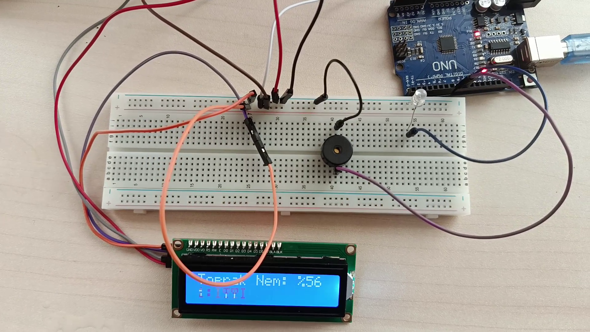
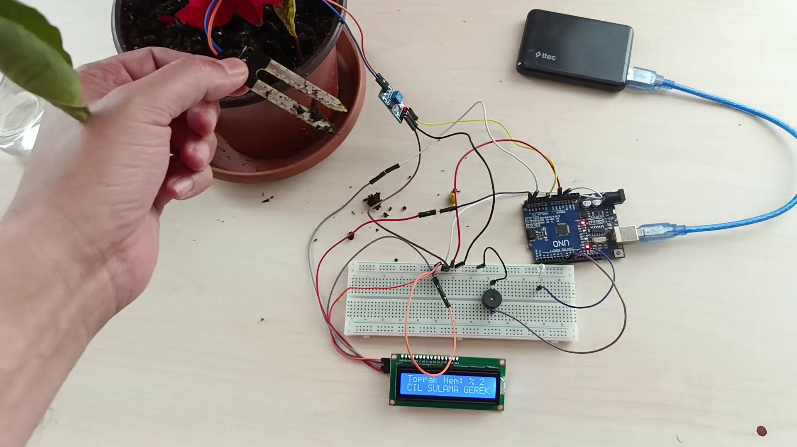

# ta2cay - Arduino Dijital Toprak Nemi ve Sulama Uyarı Sistemi

Bu proje, Arduino kullanarak bitkiler için akıllı bir sulama asistanı oluşturmayı amaçlar. Sistem, toprağın nem seviyesini anlık olarak yüzde (%) cinsinden ölçer ve 16x2 LCD ekranda gösterir. Toprak kuruduğunda veya aşırı nemli olduğunda kullanıcıyı hem görsel (LED) hem de işitsel (Buzzer) olarak uyararak bitki bakımını kolaylaştırır ve su israfını önler.

Bu proje, sensör okuma, veri işleme, ekran kullanımı ve basit uyarı mekanizmaları gibi temel Arduino konseptlerini öğrenmek için harika bir başlangıç noktasıdır.

## Projenin Çalışır Hali

<table>
  <tr>
    <td></td>
    <td></td>
  </tr>
  <tr>
    <td align="center"><i>Nem Seviyesi İdeal (%56)</i></td>
    <td align="center"><i>Acil Sulama Uyarısı (%2)</i></td>
  </tr>
</table>

## Temel Özellikler

- **Yüzdelik Nem Göstergesi:** Toprak nemini ham sensör verisi yerine, anlaşılması kolay olan %0 ile %100 arasında bir değer olarak gösterir.
- **Üç Durumlu Bilgilendirme:** LCD ekranda "I Y I D U R U M", "ACIL SULAMA GEREK" ve "ASIRI SULANMIS!" olmak üzere üç farklı durum mesajı sunar.
- **Sesli ve Işıklı Uyarı:** Toprak kritik seviyede kuruduğunda, kırmızı LED ve Buzzer ile 3 kez kesik kesik alarm vererek kullanıcıyı anında bilgilendirir.
- **Kolay Kalibrasyon:** Koddaki iki basit değişken (`HAVADA_DEGER` ve `SUDA_DEGER`) sayesinde kullanılan toprak nem sensörüne özel olarak kolayca kalibre edilebilir.
- **Düşük Maliyet ve Erişilebilirlik:** Yaygın olarak bulunan ve uygun fiyatlı elektronik bileşenler kullanılarak kolayca hayata geçirilebilir.

## Donanım ve Malzemeler

| Malzeme                      | Adet | Açıklama                                       |
| ---------------------------- | :--: | ---------------------------------------------- |
| Arduino Uno R3               |  1   | Projenin beyni                                 |
| Toprak Nem Sensörü           |  1   | Toprağın nemini ölçmek için                    |
| 16x2 I2C LCD Ekran            |  1   | Verileri göstermek için (Sırtında I2C modülü olan) |
| Aktif Buzzer                 |  1   | Sesli uyarı için                               |
| 5mm Kırmızı LED              |  1   | Görsel uyarı için                              |
| 220 Ohm Direnç               |  1   | Kırmızı LED için akım sınırlayıcı              |
| Breadboard (Orta Boy)        |  1   | Devreyi lehimlemeden kurmak için               |
| Jumper Kablolar              | Ad.  | Bağlantıları yapmak için                       |

## Devre Bağlantı Şeması

Devreyi kurarken aşağıdaki pin bağlantılarını takip edin:

| Komponent                  | Arduino Pini                             |
| -------------------------- | ---------------------------------------- |
| **Toprak Nem Sensörü (A0)**| `A0` (Analog Pin)                        |
| **I2C LCD Ekran (SDA)**    | `A4` (SDA)                               |
| **I2C LCD Ekran (SCL)**    | `A5` (SCL)                               |
| **Kırmızı LED (+)**        | `D8` (Dijital Pin 8) via 220Ω Direnç      |
| **Buzzer (+)**             | `D9` (Dijital Pin 9)                     |

*Not: Tüm komponentlerin VCC pinlerini Arduino'nun 5V pinine, GND pinlerini ise GND pinine bağlayın.*

## Kurulum ve Çalıştırma Adımları

1.  **Devreyi Kurun:** Yukarıdaki bağlantı şemasına göre tüm malzemeleri breadboard üzerine yerleştirin.
2.  **Gerekli Kütüphaneyi Yükleyin:**
    - Arduino IDE'yi açın.
    - `Araçlar > Kütüphaneleri Yönet...` menüsüne gidin.
    - Arama kutusuna `LiquidCrystal I2C` yazın ve `Frank de Brabander` tarafından yazılan kütüphaneyi kurun.
3.  **Sensörü Kalibre Edin (En Önemli Adım!):**
    - `ta2cay_dijital_sulama.ino` kodunu Arduino'ya yükleyin.
    - Arduino bilgisayara bağlıyken, IDE'nin sağ üst köşesindeki **Büyüteç** simgesine tıklayarak **Seri Port Ekranı**'nı açın.
    - **Kuru Değer:** Sensör havada (kuru) iken Seri Port Ekranı'nda yazan `Ham Deger`'i okuyun (örn: 950). Bu değeri koddaki `HAVADA_DEGER` değişkenine atayın.
    - **Islak Değer:** Sensörün metal uçlarını bir bardak suya daldırın ve Seri Port Ekranı'nda yazan en düşük `Ham Deger`'i okuyun (örn: 350). Bu değeri de `SUDA_DEGER` değişkenine atayın.
4.  **Kodu Son Kez Yükleyin:** Kalibrasyon değerlerini güncelledikten sonra kodu tekrar Arduino'ya yükleyin.
5.  **Test Edin:** Sensörü kuru bir toprağa, ardından nemli bir toprağa batırarak sistemin doğru çalışıp çalışmadığını kontrol edin.

## Kodun Çalışma Mantığı

- **`setup()` Fonksiyonu:** Program başladığında bir kez çalışır. Pinleri (`LED`, `Buzzer`) çıkış olarak ayarlar ve LCD ekranda başlangıç mesajını gösterir.
- **`loop()` Fonksiyonu:** Sürekli olarak tekrar eder.
    1.  `analogRead(nemSensorPin)` ile sensörden 0-1023 arasında bir ham değer okunur.
    2.  `map()` fonksiyonu, bu ham değeri kalibrasyon ayarlarınıza (`HAVADA_DEGER`, `SUDA_DEGER`) göre 0-100 aralığında bir yüzde değerine dönüştürür.
    3.  `if-else if-else` blokları ile yüzde değeri kontrol edilir.
    4.  Değere göre LCD ekranın ikinci satırına ilgili durum mesajı (`I Y I D U R U M`, `ACIL SULAMA GEREK` vb.) yazdırılır.
    5.  Eğer durum "ACIL SULAMA GEREK" ise, `uyariVer()` fonksiyonu çağrılır.
- **`uyariVer()` Fonksiyonu:** Bu fonksiyon, `for` döngüsü kullanarak LED ve Buzzer'ı 3 kez kısa aralıklarla çalıştırıp kapatır ve kesikli alarm efektini oluşturur.

## Lisans

Bu proje, [MIT Lisansı](LICENSE) altında lisanslanmıştır. Kodları dilediğiniz gibi kullanabilir, değiştirebilir ve dağıtabilirsiniz.
